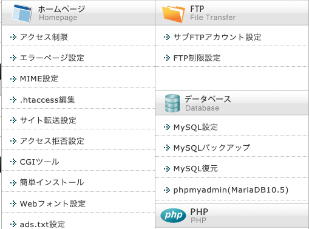

<!--
title:   【WordPress】WordPress管理画面の404アクセスエラー
tags:    WordPress,404
id:      3648b5a0678ce57af011
private: false
-->

# 概要

エックスサーバーで管理しているサイトの WordPress 管理画面にアクセスできなくなりました。
その際に試したこと、解決した手順を備忘録として残しておきます。

# エラー内容

WordPress 管理画面へのログイン画面で、アカウント及びパスワードを入力し、「ログイン」ボタンをクリックすると、404 ページに飛ばされる

# 考えられた要因

- WordPress 管理画面の「一般設定」にある、「WordPress アドレス（URL）」欄または「サイトアドレス（URL）」欄の URL が誤っている
- セキュリティ系のプラグイン

# 試したこと

- wp-config.php ファイルの編集<br>
  1. サーバー上のファイルマネージャーの[public_html]フォルダにある、「wp-config.php」ファイルをダウンロードする
  2. 本ファイルの最終行に、`define( ‘RELOCATE’, true );`を追記
  3. 本ファイルを同じフォルダにアップロード
- .htaccess の編集<br>
  1. エックスサーバー管理画面にある「.htaccess 編集」ボタンを開く
     
  2. `404-siteguard [L]`の文言が入った文章をコメントアウト<br>

上記 2 つを実施しても解消せず。

# 解決した方法

セキュリティプラグイン「SiteGuard」により強制的に 404 画面に飛ばされていたことが原因でした。解決方法を教えてくださったエックスサーバーのサポートスタッフに感謝です。

1. サーバ上の[/XXXXX.co.jp/public_html/]にある【.htaccess】ファイルの、以下の記述をコメントアウトする

```sh:.htaccess
#SITEGUARD_PLUGIN_SETTINGS_START
#==== SITEGUARD_RENAME_LOGIN_SETTINGS_START
<IfModule mod_rewrite.c>
RewriteEngine on
RewriteBase /
RewriteRule ^wp-signup\.php 404-siteguard [L]
RewriteRule ^wp-activate\.php 404-siteguard [L]
RewriteRule ^login_06737(.*)$ wp-login.php$1 [L]
</IfModule>
#==== SITEGUARD_RENAME_LOGIN_SETTINGS_END
#SITEGUARD_PLUGIN_SETTINGS_END
```

2. ファイルマネージャーを用いてサーバー上の下記フォルダ内にある　【siteguard】フォルダを、別の名称へ変更する<br>
   /XXXXX.co.jp/public_html/wp-content/plugins

# 参考サイト

- [WordPress のログイン方法とログインできない場合のトラブルシューティング【5 選】](https://web-kanji.com/posts/wordpress-how-to-login)
- [HAYAMIZ BLOG](https://hayamizbg.net/management-portal-wordpress-404/)
- [FTP ソフトの設定](https://www.xserver.ne.jp/manual/man_ftp_setting.php)
- [ファイルマネージャー](https://www.xserver.ne.jp/manual/man_tool_file.php)
