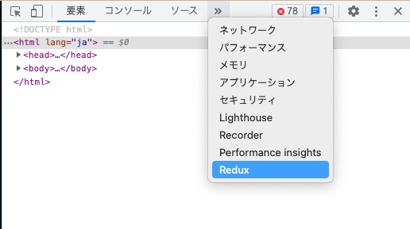
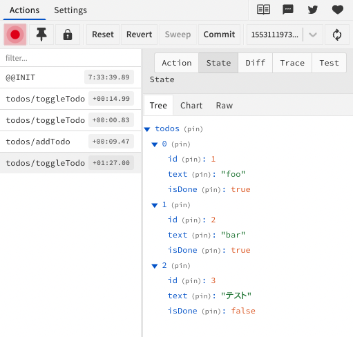

<!--
title:   【React状態管理3】Redux
tags:    react, statemanagement, redux
private: false
-->

# 概要
Reactの状態管理の1つである、`Redux`について学んだことをメモします。

# 学習内容
- [Reduxとは](#reduxとは)
- [使用方法](#使用方法)
- [Redux DevToolsとは](#redux-devtoolsとは)

# Reduxとは
コンポーネントツリー内でのデータ共有機能の外部パッケージの一つ。Fluxを用いている。<br>
`useContext`での状態管理で問題がある場合のみに利用するとよい。<br>
現場で使われていることが多く、多機能のため、数ある状態管理の中でも一押し。

[Redux公式サイト](https://redux.js.org/)

### Fluxパターンとは
MVCモデルの代替として用いられていた考え方。Viewから直接Actionを動かすことはせず、Dispatcherを経由して一方向に流れる。<br>
Fluxのデザインパターン<br>
Action -> Dispatcher -> Store -> View -> Action -> Dispatcher


1. 画面(View)上で操作(Action)を行う
1. ActionがDispatcherに送られる
1. 過去の状態（State）とDispatcherを状態をReducerでまとめてStoreを更新する<br>
現在の状態 (prev_state) + 挙動（action)　＝ 新しい状態(state)

[^1]

## 大事な3つの概念
- 必ずグローバルStateを保存するStoreは一つにする
- Stateは直接書き換えず、必ずactionを通す
- reducerは純粋な関数（前回のStateとactionから新しいStateを返す）にする

## Reduxの特長
- 状態の遷移がわかりやすい
- 長期的なメンテナンスに優れている
- アプリの状態を一つの領域で管理できる（一元化）
- DevToolsにより、デバッグが可能

# 使用方法
現在では、素のReduxを使うのではなく、Redux Toolkitを使うことが推奨されている。
## 手順
1. Redux Toolkitをインストールする
    ```
    $ yarn add @reduxjs/toolkit react-redux
    ```
1. `createSlice()`を用いて、Reduxのデータ処理を作成する（ActionやReducer、Stateといった処理を、`createSlice`によりまとめて書くことができる）
    ```javascript
    import { createSlice, PayloadAction } from "@reduxjs/toolkit";
    // createSliceでは、引数にオブジェクトを持つ
    const todosSlice = createSlice({
        name: "todos", // 名称
        initialState, // 初期値
        reducers: {
            // 前回のstateとactionを受け取って新しいstateを返す処理(reducer)
        }
    });
    ```
1. `configureStore()`を用いて、データを保持するstoreの初期値を設定する
    ```javascript
    import { configureStore } from "@reduxjs/toolkit";

    export const store = configureStore({
        reducer: {
            // createSliceで設定したreducerを指定する
        },
    })
    ```
1. Reduxを全ページ・コンポーネントで呼び出せるように、ソースの親ディレクトリ（_app.tsx等）に`Provider`でラップする（引数に`store`を指定する）
    ```javascript
    import type { AppProps } from "next/app";
    import { Provider } from "react-redux";
    import { store } from "src/state";

    export default function MyApp({ Component, pageProps }: AppProps) {
        return (
            <Provider store={store}>
                <Component {...pageProps} />
            </Provider>
        );
    }
    ```
1. `useSelector`を用いて、ページやコンポーネントで欲しいデータだけを呼び出す
    ```javascript
    import { FC } from "react";
    import { useSelector } from "react-redux";

    export const TodoCounter: FC = () => {
        const todos = useSelector((state) => state.todos);
        return (
            <h2>TODO: {todos.length}件</h2>
        )
    }
    ```

## 使用例
`createSlice`によりReduxのデータ処理を設定する
```javascript :state/todos.ts
import { createSlice, PayloadAction } from "@reduxjs/toolkit";
import { Todo } from "src/types";

const initialState: Todo[] = [
    { id: 1, text: "foo", isDone: false },
    { id: 2, text: "bar", isDone: true },
];

// createSliceを使えば、actionもreducerもひとまとめに書ける
const todosSlice = createSlice({
    name: "todos",
    initialState,
    reducers: {
        // reduxToolkitではmutableにコードを書ける（pushなどが使える）
        addTodo: (state, action: PayloadAction<Pick<Todo, "text">>) => {
            state.push({
                id: state.length + 1, 
                text: action.payload.text, 
                isDone: false,
            })
        },
        toggleTodo: (state, action: PayloadAction<Pick<Todo, "id">>) => {
            state.forEach((todo) => {
                if (todo.id === action.payload.id) {
                    todo.isDone = !todo.isDone;
                }
            })
        }
        // defaultは不要。addもtoggleでもない場合、前回のStateをそのまま返すため。
    }
});

// todosSliceを他のファイルで使えるようにexportする
export const { addTodo, toggleTodo } = todosSlice.actions; // createSliceのactionsは分割代入が使える
export const todosReducer = todosSlice.reducer;
```

store内のデータの初期値として`todosReducer`を設定する
```javascript :state/index.ts
import { configureStore } from "@reduxjs/toolkit";
import { todosReducer } from "./todos";

export const store = configureStore({
    reducer: {
        todos: todosReducer,
    },
})

export type RootState = ReturnType<typeof store.getState>;
```

全てのコンポーネントを`Provider`でラップする
```javascript :_app.tsx
import type { AppProps } from "next/app";
import { Provider } from "react-redux";
import { Layout } from "src/components/Layout";
import { store } from "src/state";

export default function MyApp({ Component, pageProps }: AppProps) {
  return (
    // Providerで子コンポーネント全体をラップする
    <Provider store={store}>
      <Layout>
        <Component {...pageProps} />
      </Layout>
    </Provider>
  );
}
```

コンポーネント内で欲しいデータをstoreから取得する
```javascript :TodoCounter.tsx
import { FC } from "react";
import { useSelector } from "react-redux";
import { RootState } from "src/state";

export const TodoCounter: FC = () => {
    // stateからtodosを取得する
    const todos = useSelector((state: RootState) => state.todos);
    return (
        <h2>TODO: {todos.length}件</h2>
    )
}
```
# Redux DevToolsとは
GoogleChromeの拡張機能である、[Redux DevTools](https://chrome.google.com/webstore/detail/redux-devtools/lmhkpmbekcpmknklioeibfkpmmfibljd?hl=ja)を用いることで、より効率的にReduxを利用できる。
## Redux DevToolsの特長
- 1つ1つのアクションを細かく見れる
- 過去の状態を確認でき、かつ容易に戻すことができる

GoogleChromeの検証画面からアクセスする


<center>アクセス方法</center>

## 使い方
action, state, diffなどでReduxの各操作の状態のチェックできる。
- action : 処理内容
- state  : Storeの状態
- diff   : 前回処理からの差分




# 参考
[IT Kingdom](https://it-kingdom.com)<br>
[GitHubリポジトリ](https://github.com/yamashin01/react_state_management/tree/main/Redux02)<br>
[Redux公式ページ](https://react-redux.js.org)<br>
[Redux Three Principles](https://redux.js.org/understanding/thinking-in-redux/three-principles)<br>
[Redux Style Guide](https://redux.js.org/style-guide/)<br>
[Redux Toolkit公式ページ](https://redux-toolkit.js.org/)
